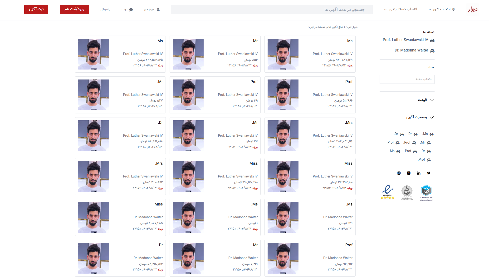
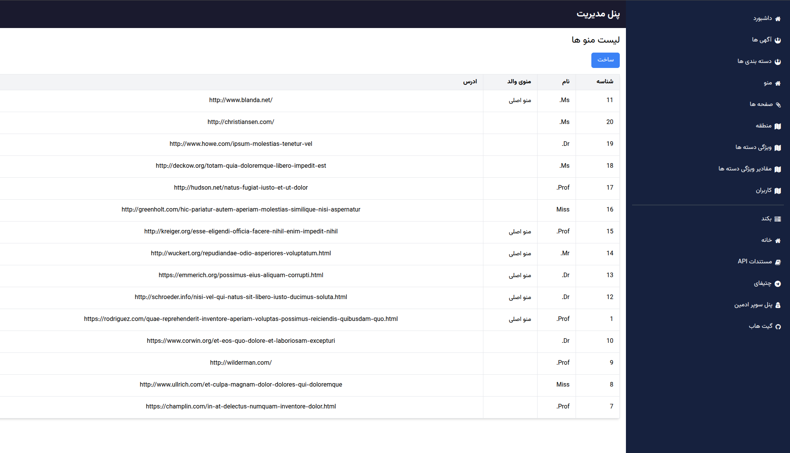

### Advertisement shop made with Next.js
1. frontend of [bazaar-laravel](https://github.com/moham7dreza/bazaar-laravel) project in my repo
2. in laravel if you are run `make dev` all servers should be up include `NEXT` and no need to run `npm run dev` here

    
Root

    
    
Admin

    

### Requirements
1. `NPM` and `Node` above v20

### Commands
1. run `make dev` to reload and start project in development mode
2. run `next info` for info about next.js
3. run `next lint` for linting errors

### setup
1. run `make fix-permissions` to fix access
2. run `make install` to an init project
3. apply required changes in .env file if needed
4. goto http://localhost:3000 in your browser to see a result
